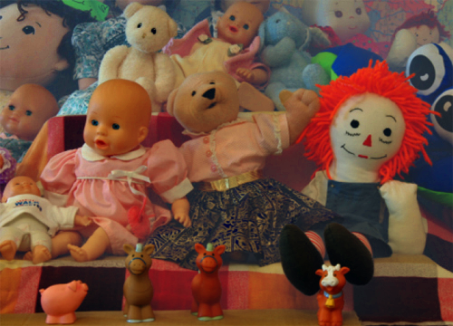

## Single Image Haze Removal Using Dark Channel Prior

Implementation of Single Image Haze Removal Using Dark Channel Prior.

Dependence: OpenCV 3.0

Results

### Ref
+ He K, Sun J, Tang X. Single image haze removal using dark channel prior[J]. Pattern Analysis and Machine Intelligence, IEEE Transactions on, 2011, 33(12): 2341-2353.
+ He, Kaiming, Jian Sun, and Xiaoou Tang. "Guided image filtering." Pattern Analysis and Machine Intelligence, IEEE Transactions on 35.6 (2013): 1397-1409.
